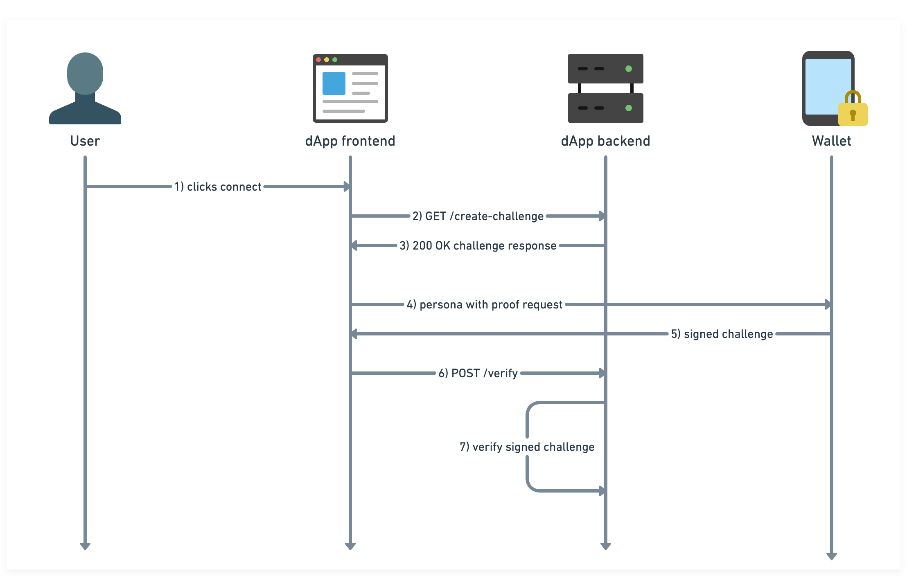
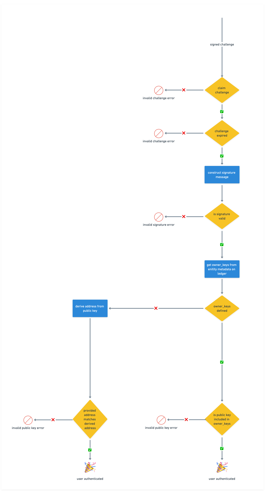

# Radix Off-Ledger Authentication (ROLA) example

This is a simple end-to-end implementation of ROLA using a express server as backend and TypeScript dApp as client.

## Getting started

Run `npm install` to install dependencies

```bash
npm install
```

Run `npm run dev` to start the server and client

```bash
npm run dev
>>> Server running on "http://localhost:3000"
>>> Client running on "http://localhost:4000"
```

Go to [Client](http://localhost:4000) and click ROLA button to trigger the flow.

## ROLA verification flow

Lets go through an end-to-end ROLA verification flow that includes sending a request to the wallet to sign a challenge and verifying that the signature was created by the owner.



### 1) User enters a dApp and clicks connect in √ Connect Button

Lets assume that the user is not a new Radix dApp user. She has gone through the onboarding process and have a Radix Wallet installed, setup with a persona. She clicks on connect in √ Connect Button.

### 2-3) dApp backend creates a challenge

The challenge is a random 32 bytes hex encoded string.

It looks something like this:
`4ccb0555d6b4faad0d7f5ed40bf4e4f0665c8ba35929c638e232e09775d0fa0e`

The challenge is generated and stored in the dApp backend and return to the client.

**Why do we need a challenge?**

The challenge plays an important role in the authentication flow, namely preventing [replay attacks](https://www.educative.io/answers/what-is-a-replay-attack) from bad actors. The challenge ensures that an authentication request payload sent from the client can only be used once. After a challenge is claimed by a request, the subsequent requests can no longer be resolved successfully with the same payload. As a security best practice a stored challenge should have a short expiration time, in this case, just enough time for a user to interact with the wallet.

In our implementation we are storing the challenges in in-memory. That works for development purposes. In a production environment, a database should be used to allow challenges to be claimed in between instances of servers in a horizontal scaling setup.

### 4-5) Wallet creating a signature

Now we have everything we need for the wallet to create a signature. The dApp sends a wallet data request through Radix Connect asking for a proof of ownership.

After user approving the request, the wallet sends back a response containing a signed challenge.

```typescript
{
  type: "persona" | "account";
  challenge: string;
  proof: {
    publicKey: string;
    signature: string;
    curve: "curve25519" | "secp256k1";
  }
  address: string;
}
```

The values in the wallet response are needed for the backend to verify that the user is the owner of the address.

### 6-7) dApp backend verifies the proof using ROLA

After the dApp frontend sends the signed challenge to the dApp backend, the ROLA verification flow starts.



**1. Claim challenge**

The first step in the verification process is to check if the challenge provided in the request body is valid. The challenge should exist as an entry in the challenge store. In our example the challenge store is a simple in-memory map that stores unclaimed challenges. If the challenge exists in the store, get and delete that challenge entry then proceed to the next step.

```typescript
// A simple in-memory store for challenges. A database should be used in production.
const ChallengeStore = () => {
  const challenges = new Map<string, { expires: number }>();

  const create = () => {
    const challenge = secureRandom(32); // 32 random bytes as hex string
    const expires = Date.now() + 1000 * 60 * 5; // expires in 5 minutes
    challenges.set(challenge, { expires }); // store challenge with expiration

    return challenge;
  };

  const verify = (input: string) => {
    const challenge = challenges.get(input);

    if (!challenge) return false;

    challenges.delete(input); // remove challenge after it has been used
    const isValid = challenge.expires > Date.now(); // check if challenge has expired

    return isValid;
  };

  return { create, verify };
};
```

**2. Check if challenge has expired**

The challenge entry should have metadata regarding expiration. We proceed to check if the challenge is within expiration time. If valid, proceed to the next step.

**3. Construct the signature message**

In this step we are creating the signature message needed to verify the signature.

**The signature message is composed of the following:**

|                                       |                                                                                                                                                                                                                                                                             |
| ------------------------------------- | --------------------------------------------------------------------------------------------------------------------------------------------------------------------------------------------------------------------------------------------------------------------------- |
| **prefix**                            | "R" (as in ROLA) in ascii encoding                                                                                                                                                                                                                                          |
| **challenge**                         | Challenge provided in request body                                                                                                                                                                                                                                          |
| **length of dApp definition address** | String length of the dApp definition address                                                                                                                                                                                                                                |
| **dApp definition address**           | The dApp definition address of the requesting dApp. Note that this value is not provided in the request body. On top of challenge, having this value in the signature adds an additional layer of security preventing bad actors to sign in into dApps using another proof. |
| **origin**                            | The origin of the dApp (e.g. `https://dashboard.radixdlt.com`). This is a value that is added to the wallet data request by the Connector extension. As with the dApp definition address, the dApp needs to be aware of its origin.                                         |

The message is then hashed using [blake2b](<https://en.wikipedia.org/wiki/BLAKE_(hash_function)>) algorithm and encoded as a hex string.

**4. Check if the signature is valid**

In this step we verify the signature using elliptic curve cryptography.

```typescript
{
  publicKey: string;
  signature: string;
  curve: "curve25519" | "secp256k1";
}
```

In the example we are using the [elliptic](https://www.npmjs.com/package/elliptic) library for elliptic curve cryptography. You are free to choose any tool that enables signature verification for `curve25519` and `secp256k1`.

```typescript
const publicKey =
  input.proof.curve === "curve25519"
    ? curve25519.keyFromPublic(input.proof.publicKey, "hex")
    : secp256k1.keyFromPublic(input.proof.publicKey, "hex");

const isValid = publicKey.verify(signatureMessageHex, input.proof.signature);
```

If the signature is valid, proceed to the next step.

**5. Get the entity metadata from gateway**

We query the ledger through the gateway API to get `metadata` for the address provided in the request body.

In the `metadata` we are specifically looking for `owner_keys` field.

The `owner_keys` value contains a list of blake2b hashed public keys in hex string encoding.

There are two paths here:

**A) `owner_keys` metadata set**

If the `owner_keys` metadata value is set we need to hash the publicKey provided request body and check if it matches the value in `owner_keys`.

```typescript
blake2b(Buffer.from(publicKey, "hex"))
  .map((hash) => hash.subarray(-29))
  .map((hash) => Buffer.from(hash).toString("hex"));
```

If it matches, the user is authenticated

**B) `owner_keys` metadata not set**

In this case we use [TypeScript Radix Engine Toolkit (RET)](https://github.com/radixdlt/typescript-radix-engine-toolkit) to derive an address from the public key provided in the request.body

If the derived address matches the `address` provided `request.body.proof.publicKey`, the user is authenticated

### Keeping users authenticated

ROLA is meant to be a secure and framework agnostic way to authenticate a user using public key cryptography enabled by the Radix wallet. After a successful ROLA verification it is up to the dApp to establish a persistent authentication strategy that allows the client to stay authenticated between requests.
